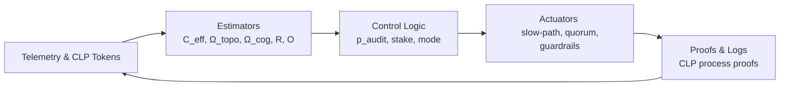

# Adversarial Occlusion and Mechanism Integrity V1

9/22/25

# AOMI Framework v1.0

## Adversarial Occlusion & Mechanism Integrity

*A comprehensive framework for designing systems resistant to adversarial exploitation of accountability mechanisms*

---

## Executive Summary

The AOMI Framework addresses a critical gap in mechanism design: how to prevent sophisticated actors from deliberately exploiting the blind spots, uncertainty mechanisms, and resolution limits that necessarily exist in any complex accountability system.

AOMI operates on the principle that **ethical occlusion is geometric, not malicious** - it emerges from the structure of complex systems rather than individual bad actors. However, once these occlusion pockets exist, they become natural targets for strategic exploitation.

The framework provides both theoretical foundations and practical implementation patterns for building anti-fragile systems that become stronger when attacked, rather than weaker.

---

## I. Theoretical Foundations

### Core Insight: The Gaming Inevitability Principle

**Any sufficiently sophisticated accountability mechanism will be gamed by actors who understand its structure.**

This gaming follows predictable patterns:

- **First-order gaming**: Exploiting known rules (regulatory arbitrage, tax loopholes)
- **Second-order gaming**: Exploiting measurement systems (teaching to the test, p-hacking)
- **Third-order gaming**: Exploiting occlusion itself (steering decisions into undecidable zones)

### The Meta-Gaming Escalation

In the age of AI, gaming capabilities escalate exponentially:

1. AI can ingest complete framework documentation
2. AI can systematically probe for vulnerabilities
3. AI can coordinate sophisticated multi-vector attacks
4. AI can adapt gaming strategies in real-time

**AOMI Response**: Use AI to design AI-resistant mechanisms through adversarial co-evolution.

### Relational Field Power Dynamics

Drawing from power field coherence theory, AOMI recognizes that gaming attempts create **field curvature distortions** that can be detected and countered:

- **Gaming creates exposure**: Sophisticated gaming requires more coordination, documentation, and complexity than honest behavior
- **Uncertainty has beneficiaries**: Someone always benefits from keeping decisions unresolved
- **Observer relativity matters**: Gaming looks different from different embedding levels

---

## II. AOMI Threat Model

### Primary Attack Vectors

**Occlusion-Seeking Behavior**

- Route high-impact decisions through high-Ω zones
- Exploit fast lanes, siloed pathways, low-telemetry workflows
- Deliberately increase temporal compression to create computational irreducibility

**Responsibility Laundering**

- Fragment decisions across actors and time
- Ensure no single entity crosses attribution thresholds
- Create plausible deniability through complexity

**Metric Gaming (Goodhart/Campbell Effects)**

- Optimize proxy measures while worsening true outcomes
- Exploit the difference between what's measured and what matters
- Game the framework's own measurement systems

**Topology Sculpting**

- Create artificial chokepoints to manufacture Ω_topo
- Build silos that hide decision pathways
- Engineer dependencies that obscure causation

**Cognitive Jamming**

- Overload reviewers to raise Ω_cog
- Time critical information for minimal processing capacity
- Use complexity as a weapon against comprehension

**Temporal Arbitrage**

- Push decisions when Δt is predictably small
- Exploit end-of-quarter pressures, on-call gaps, deadline compression
- Force premature superposition collapse through artificial urgency

**Uncertainty Weaponization** (New Category)

- Evidence dilution attacks to prevent resolution
- Support fragmentation to break coherent narratives
- Context pollution to overwhelm coherence scoring
- Frame confusion to create irreconcilable perspectives

---

## III. AOMI Defense Architecture

### Layer 1: Paradoxical Policing

**Core Principle**: Make high-occlusion pathways more risky, not less risky.

```
Audit Probability = g(Ω) where g'(Ω) > 0

```

**Implementation Patterns**:

- **Occlusion Tax**: Extra approvals, stake requirements, delays scale with Ω
- **Inverse Scrutiny**: Foggy paths trigger enhanced monitoring
- **Complexity Penalty**: More complex justifications require higher evidence standards

### Layer 2: Adversarial Reserve Capacity

**Core Principle**: Build excess capacity specifically to absorb gaming without system failure.

**Reserve Allocation Strategy**:

```python
reserves = {
    'attention_bandwidth': base_capacity * 0.25,
    'constraint_flexibility': base_capacity * 0.15,
    'response_cycles': base_capacity * 0.30,
    'measurement_redundancy': base_capacity * 0.20
}

```

**Graceful Degradation Protocol**:

- Monitor reserve consumption in real-time
- Activate backup systems when gaming pressure exceeds thresholds
- Degrade gracefully rather than failing catastrophically

### Layer 3: Exploitation-as-Signal Intelligence

**Core Principle**: Treat gaming attempts as valuable intelligence about system vulnerabilities.

**Intelligence Collection**:

- **Attack Pattern Library**: Catalog and classify gaming techniques
- **Vulnerability Mapping**: Learn about blind spots from gaming targets
- **Threat Landscape Analysis**: Generate strategic insights from gaming trends

**Batch Response Strategy**:

- Queue defensive improvements to avoid revealing detection
- Deploy countermeasures in batches to prevent gaming adaptation
- Use gaming intelligence to proactively harden untargeted vulnerabilities

### Layer 4: Self-Exposure Amplification

**Core Principle**: Gaming behavior naturally creates more signals than honest behavior.

**Detection Mechanisms**:

- **Coordination Overhead**: Gaming requires more communication
- **Explanation Complexity**: Justifications become increasingly elaborate
- **Pattern Inconsistency**: Behavior deviates from baseline efficiency
- **Resource Inefficiency**: Gaming wastes effort compared to direct approaches

**Amplification Strategy**:

```
Exposure Factor = Gaming Complexity / Honest Behavior Baseline
Detection Probability = f(Exposure Factor)

```

### Layer 5: Power Field Beneficiary Analysis

**Core Principle**: Surface who benefits from uncertainty and occlusion.

**Beneficiary Detection**:

- Map relational power fields around unresolved decisions
- Identify actors who gain from status quo uncertainty
- Distinguish regenerative vs extractive uncertainty patterns
- Make embedding blindness visible across organizational levels

**Field Curvature Transparency**:

- Visualize how uncertainty shapes power relationships
- Show opportunity gradients around occlusion pockets
- Reveal gaming incentives through field analysis

### Layer 6: Superposition Integrity Protection

**Core Principle**: Prevent forced collapse into single "unresolved" states.

**Protection Mechanisms**:

- **Distributed Attention**: Avoid concentrated focus that forces premature collapse
- **Temporal Extension**: Resist artificial urgency that prevents proper deliberation
- **Multi-Objective Maintenance**: Preserve multiple valid optimization targets
- **Option Space Preservation**: Keep multiple viable futures available

---

## IV. Integration with Existing Frameworks

### CFAR Integration

**Enhanced State Dynamics**:

```python
class AOHIState(CFARState):
    def __init__(self, Y, N, A, C, B, gaming_exposure=0.0):
        super().__init__(Y, N, A, C, B)
        self.G = gaming_exposure  # Gaming exposure level

def aomi_cfar_step(state, controls, gaming_indicators):
    # Standard CFAR dynamics
    new_state = cfar_step(state, controls)

    # AOMI enhancement: gaming creates exposure
    if gaming_indicators.detected:
        new_state.G += calculate_exposure_amplification(gaming_indicators)
        new_state.A += new_state.G * 0.1  # Gaming increases visibility

    return new_state

```

**Gaming-Aware Control**:

- Adjust PID deadbands when threshold dancing detected
- Modify bandit exploration when reward engineering suspected
- Activate fluctuation control when precision gaming identified

### CLP Integration

**Power-Aware Context Queries**:

```python
class PowerAwareCLPBroker:
    def query_with_aomi_analysis(self, clp_query):
        clp_results = self.standard_clp_query(clp_query)

        if clp_results.get('unresolved_clusters'):
            aomi_analysis = {
                'uncertainty_beneficiaries': self.identify_beneficiaries(clp_results),
                'gaming_risk_assessment': self.assess_gaming_probability(clp_results),
                'field_curvature_impact': self.analyze_power_implications(clp_results),
                'regenerative_classification': self.classify_uncertainty_pattern(clp_results)
            }
            clp_results['aomi_analysis'] = aomi_analysis

        return clp_results

```

**Enhanced Resolution Enforcement**:

- Dynamic thresholds that increase under gaming pressure
- Cross-frame coherence requirements when frame shopping detected
- Temporal buffers when deadline manipulation suspected

---

## V. Implementation Playbook

### Phase 1: Gaming Detection (Weeks 1-4)

**Core Capabilities**:

- Implement basic gaming signature detection
- Deploy coordination overhead monitoring
- Create explanation complexity analysis
- Build pattern inconsistency detection

**Success Metrics**:

- Can detect known gaming patterns with 80% accuracy
- False positive rate below 10%
- Detection latency under 24 hours

### Phase 2: Adaptive Defenses (Weeks 5-8)

**Core Capabilities**:

- Deploy paradoxical policing mechanisms
- Implement dynamic threshold adjustment
- Create adversarial reserve management
- Build exploitation intelligence system

**Success Metrics**:

- Gaming attempts cost 2x more than honest behavior
- System maintains performance under 50% gaming load
- Intelligence system identifies new attack vectors

### Phase 3: Power Field Integration (Weeks 9-12)

**Core Capabilities**:

- Implement beneficiary analysis
- Deploy superposition integrity protection
- Create field curvature visualization
- Build regenerative/extractive classification

**Success Metrics**:

- Can identify uncertainty beneficiaries with 90% accuracy
- Prevents forced superposition collapse
- Maintains coherence under complex gaming attacks

### Phase 4: Anti-Fragile Evolution (Weeks 13-16)

**Core Capabilities**:

- Deploy system parameter evolution
- Implement batch countermeasure deployment
- Create proactive vulnerability hardening
- Build gaming strategy prediction

**Success Metrics**:

- System becomes measurably stronger after gaming attempts
- Proactive countermeasures prevent 60% of predicted attacks
- Parameter evolution maintains gaming resistance over time

---

## VI. Measurement and Evaluation

### Gaming Resistance Metrics

**Primary Indicators**:

- **Ξ (Exploitability Index)**: `(1-𝒪) × E[Penalty]⁻¹`
- **Gaming Cost Ratio**: `Cost(Gaming) / Cost(Honest Behavior)`
- **System Coherence Under Attack**: Coherence preservation during gaming attempts
- **Adaptation Rate**: Speed of defensive evolution relative to gaming evolution

**Secondary Indicators**:

- Detection accuracy and false positive rates
- Reserve capacity utilization patterns
- Intelligence system discovery rates
- User satisfaction with transparency measures

### Continuous Monitoring

**Real-Time Dashboards**:

- Gaming pressure indicators across all system components
- Reserve capacity consumption and remaining buffers
- Power field visualizations around active decisions
- Uncertainty beneficiary analysis for unresolved items

**Periodic Assessment**:

- Quarterly red-team exercises with AI-assisted gaming
- Annual framework evolution based on discovered vulnerabilities
- Continuous parameter optimization based on gaming pressure

---

## VII. Ethical Considerations

### Transparency Principles

**What to Make Transparent**:

- General AOMI principles and objectives
- Gaming detection methodologies (high level)
- Power field analysis results
- Beneficiary identification outcomes

**What to Keep Private**:

- Specific detection algorithms and thresholds
- Gaming pattern signatures and triggers
- Real-time monitoring data and feeds
- Individual actor gaming risk scores

### Fairness and Accountability

**Avoiding Discrimination**:

- Gaming detection must be behavior-based, not identity-based
- False positive mitigation with clear appeal processes
- Proportional responses that match gaming severity
- Regular bias auditing of detection algorithms

**Democratic Oversight**:

- Public oversight of AOMI implementation decisions
- Community input on framework evolution
- Open source reference implementations
- Academic research collaboration and validation

---

## VIII. Future Directions

### Research Priorities

**Theoretical Development**:

- Formal proofs of gaming resistance properties
- Optimal reserve capacity allocation strategies
- Recursive gaming/counter-gaming equilibria
- Cross-system AOMI coordination protocols

**Practical Applications**:

- Domain-specific AOMI implementations (financial, healthcare, AI governance)
- Scaling strategies for large organizations
- Integration with blockchain and decentralized systems
- Real-time adaptation to novel gaming techniques

### Technology Evolution

**AI Integration**:

- GPT-based gaming strategy generation for testing
- Machine learning for pattern recognition and prediction
- Automated red-team systems for continuous testing
- LLM-assisted explanation and justification analysis

**Platform Development**:

- Open-source AOMI reference implementation
- API standards for cross-platform integration
- Monitoring and visualization toolkits
- Community-contributed gaming pattern libraries

---

## IX. Conclusion

The AOMI Framework represents a paradigm shift from reactive security to proactive anti-fragility in mechanism design. By assuming sophisticated gaming as inevitable rather than exceptional, AOMI enables the creation of systems that become stronger through adversarial pressure rather than weaker.

The integration with existing frameworks like CFAR and CLP demonstrates that AOMI can enhance rather than replace current approaches, providing a meta-layer of gaming resistance that preserves the benefits of sophisticated control theory while protecting against its exploitation.

Most importantly, AOMI recognizes that the future of accountability lies not in eliminating gaming, but in designing systems where gaming becomes transparent, expensive, and ultimately self-defeating. In this way, AOMI transforms the adversarial dynamic from a zero-sum competition into a positive-sum evolution toward more robust and trustworthy institutions.

The framework's emphasis on surfacing power dynamics and uncertainty beneficiaries makes it particularly relevant for democratic governance and organizational accountability, where hidden influence and manufactured confusion pose existential threats to legitimacy and effectiveness.

As AI capabilities continue to advance, frameworks like AOMI become not just useful but essential for maintaining institutional coherence in an era of exponentially increasing gaming sophistication.

---

*This framework constitutes a living document that evolves through application of its own principles - using adversarial pressure to strengthen theoretical foundations and practical implementations.*

# TC/EO + AOMI — Implementation Companion (v1)

*A practical, math‑backed guide for deploying Temporal Compression & Ethical Occlusion (TC/EO) with Adversarial Occlusion & Mechanism Integrity (AOMI) and CLP proofs.*

**Companions:**

- *Temporal Compression — Glossary v1*
- *Temporal Compression & Ethical Occlusion — v2 (Rebuild)*

---

## 1) Scope & Outcomes

**Goal:** Ship a measurable accountability mechanism that (i) controls temporal compression, (ii) keeps attribution probability above a floor, and (iii) remains incentive‑compatible under adversarial gaming.

**Primary SLOs:**

- (attribution probability) ≥ for each critical decision class.
- Exploitability index .
- Resolution–Responsibility law holds live: or an automatic mode switch fires.
- Reserve SLOs (attention, review cycles) stay above thresholds.

---

## 2) Core Equations (deployment subset)

**Layer compression:** ,  = compressed.

**Effective compression:**

- Risk‑weighted mean:
- Bottleneck max:

**Occlusion (channels + combo):**

- Tempo:
- Topology: (measured; see §4)
- Cognition: (measured; see §4)
- Combined:

**Observability (graded):**

**Resolution–Responsibility law (Design Axiom):** .

**Compression dynamics:** .

**Exploitability index:** .

**Paradoxical policing:** , with fairness constraints.

**Incentive‑compatibility (No‑gaming condition):**

with , .

---

## 3) Data Model & Instrumentation

**3.1 Tables (logical)**

- **decisions**: id, class, actor_id, start_ts, end_ts, , path_id, impact_estimate
- **events**: id, decision_id, ts, type, payload_hash, source
- **actors**: id, org_unit, role, privileges
- **handoffs**: from_actor, to_actor, ts, intent_hash, evidence_hash *(CLP witness tokens)*
- **topology**: node_id, edges, degree, clustering, chokepoint_score
- **telemetry**: logs, spans, trace_id, error_rate, latency
- **reviews**: reviewer_id, ts, findings, actions, appeal

**3.2 CLP Witness Token (JSON sketch)**

```json
{
  "decision_id": "...",
  "actor": "...",
  "ts": "ISO",
  "intent_hash": "...",
  "evidence_hash": "...",
  "frame": "policy|risk|ethics",
  "sig": "ed25519..."
}

```

**3.3 Features for Ω & Exposure**

- *Tempo:* from ; compute .
- *Topology:* mean degree , clustering , betweenness, chokepoint score.
- *Cognition:* reviewer load (#open reviews/reviewer), queue age, off‑hour flag, UI dwell time.
- *Exposure (Gaming) features:* coordination edge‑lift (emails/CC/slack motifs), justification perplexity vs. baseline, path oddity (distance from shortest accountable path), end‑of‑period clustering.

---

## 4) Estimation Pipelines

**4.1 Live estimators**

- : recompute per decision from clocks.
- : monotone map of (clustering, chokepoints) → [0,1].
- : monotone map of (reviewer load, off‑hours, queue age) → [0,1].
- : combined formula.
- : chosen definition (mutual info or Fisher); start with proxy: trace/metric richness score.
- : logistic .
- Gaming Exposure Score (GES): normalized blend of exposure features.

**4.2 Calibration**

- Fit from historical attribution successes/failures.
- Fit using vs. incident rates.
- Choose thresholds () by risk appetite.

---

## 5) Control Logic (online)

```python
if R*C_eff > R_max:
    mode = "decompress"  # widen Δt, add quorum, or halt
elif O_hat < O_min:
    mode = "instrument"  # raise R via flags, traces, pre-checks
else:
    mode = "normal"

p_audit = p0 + s*(Omega_hat**n1) + s2*(C_eff**n2)
if fairness_guardrail_breached:
    p_audit = mix_with_randomization(p_audit)

if Omega_budget_exceeded(decision_class):
    enforce_slow_path()

stake = t0 + t1*(Omega_hat**m)

```

**Reserve SLOs:** If attention or review‑cycle reserves < SLO, freeze non‑critical changes and expand  on critical paths.

---

## 6) Dashboards & Budgets

**Per decision class:**

- Live: , components, , , GES,
- Budgets/Floors: Ω budget, , reserve SLO, audit rate band, stake band
- Outcomes: incidents, near‑misses, attribution latency, appeals

**Mermaid (signal→control→proof):**



---

## 7) Policy Templates (copy/paste)

**Invariants:**

1. Visibility floor for critical actions (min trace density).
2. Quorum to enter high‑Ω paths; record CLP proofs.
3. Auto‑rollback available in Zone‑3.
4. Mode switch when or .

**Fairness rules:**

- Behavioral signals only; monitor disparate impact.
- Randomization added where needed; appeals SLA ≤ 5 business days.

---

## 8) Calibration & Tuning Playbook

1. **Historical fit:** label past decisions with attribution success; fit , .
2. **A/B policy tests:** compare (fast+high audit) vs (slow+low audit) for at fixed throughput.
3. **Set Ω budgets:** per class, align with harm profile.
4. **Tune penalties & taxes:** choose to satisfy the no‑gaming inequality.
5. **Red‑team sprints:** quarterly; convert successes into metrics/guardrails/tests.

---

## 9) Worked Mini‑Examples

**Highway analogue:** speed↑ → ↑ → ↑ → ↓; raise  (sensors), add guardrails (rate limiters), or slow.

**Deployment pipeline:** batch risky changes → ↑; enforce canaries (raise ), Ω budgets trigger slow‑path when exceeded; rollback auto if  dips.

---

## 10) Simulation Appendix (sketch)

- Graph with mean degree , clustering .
- Events propagate; decisions sample paths.
- Control knobs: change ; p_audit, stake; Ω budgets.
- Metrics: , components, , .

Pseudo:

```python
for t in timeline:
  sample_demand(); update_C_eff()
  compute_Omega_components(); O = combine()
  choose_controls(); apply_mode_switches()
  realize_attacks(); update_metrics()

```

---

## 11) Governance & Transparency

- Publish principles, budgets, floors; keep thresholds/weights private.
- Community oversight for invariants and appeals.
- Log *process proofs* (CLP tokens) for all exceptions.

---

## 12) Acceptance Criteria

- ≥ target for ≥95% of critical decisions.
- below threshold for 8 consecutive weeks.
- No‑gaming inequality holds in post‑hoc audits across top 3 decision classes.
- Reserve SLOs violated <2% of hours; grace mode engaged as designed.

---

## 13) Parameter Defaults (tune in calibration)

- (observability curve)
- (tempo‑occlusion sensitivity)
- (audit gradient)
- , (occlusion tax)
- ,

> Note: values are placeholders; calibrate empirically.
> 

---

## 14) Roadmap (4 phases)

**P1 (Weeks 1–4):** Telemetry, CLP tokens, estimators for , basic dashboard.

**P2 (Weeks 5–8):** Paradoxical policing, Ω budgets + slow‑path, reserve SLOs.

**P3 (Weeks 9–12):** Exposure features, fairness guards, batch countermeasures.

**P4 (Weeks 13–16):** Red‑team automation, A/B policy optimizer on .

---

## 15) Quick Glossary (operational)

- **C_eff**: effective compression (speed pressure).
- **Ω**: undecidability share (fog); components: tempo/topo/cog.
- **R, R_max**: resolution & ethical bandwidth.
- **𝒪**: attribution probability.
- **Ξ**: exploitability index (lower is better).
- **B, G**: buffers & guardrails.
- **GES**: gaming exposure score.
- **CLP token**: signed proof of accountable path.

---

**Tagline:** *Measure the fog, price the fog, and slow or harden the path when the fog wins.*