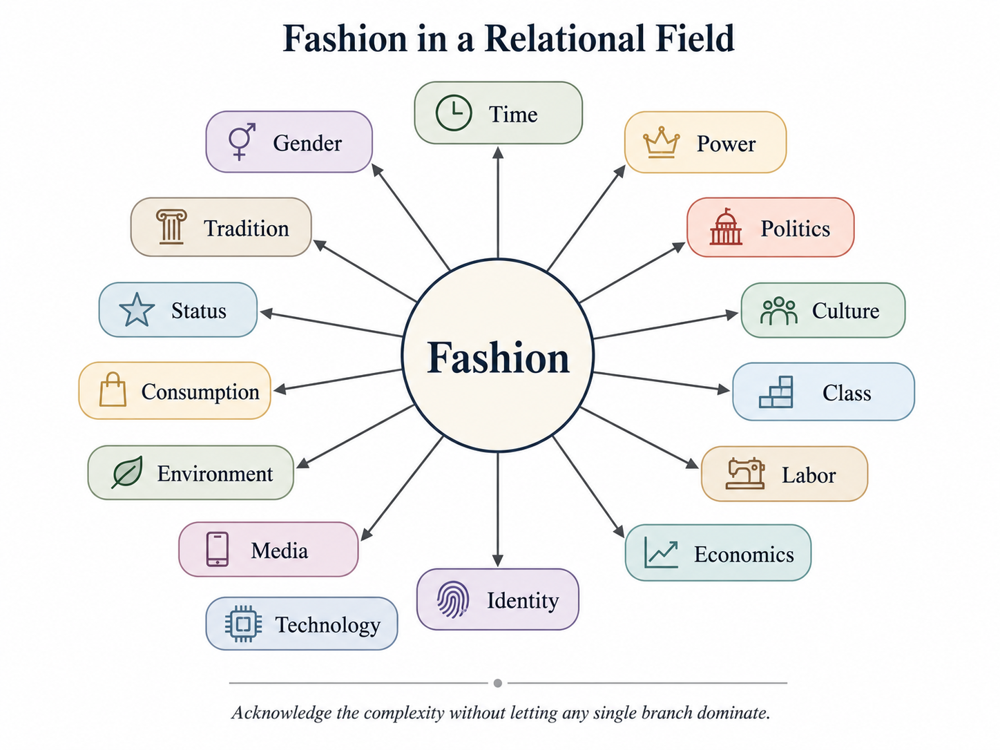

# The Durable Heresy of Fast Fashion

You probably aren’t individually capable of destroying the world. Your shirt might be, though. 

I am by no means an expert in clothing and textiles. My skillset inhabits the domains that surround this one however, and over the course of these next few pages, I’ll paint a picture that will hopefully give you some perspective you didn’t have before. 

Let’s define some terms before we start. 

[Fashion](https://www.merriam-webster.com/dictionary/fashion) as typically used is defined as such: 

<aside>
👕

(1): the prevailing style (as in dress) during a particular time, 

**(3):** the business of creating and selling clothes in new styles

</aside>

In a bit of foreshadowing, we can see that by definition, the idea of fashion is tied to the passage of time. The word I’ll be using throughout to refer to this is “[temporal](https://app.notion.com/p/Temporal-Constraint-Lamination-3131158833208049af13c198c296418b?pvs=21)” (of or relating to time as opposed to eternity).

In such case, the temporal dynamics of fashion are linked together, or coupled. What is in fashion depends on time, culture, and dominant power structures of a given geographic location. 

You can derive a great deal of information about a culture when you examine the fashion trends over time. Consider how women’s swimsuits have changed. Compare today’s swimsuits for women today to those from the 1920’s and you can see how the concepts of modesty, women’s rights, and empowerment have shifted over the last 100 years. (I used my calculator to verify that 1920 was indeed 106 years ago, apologies for any temporal inconvenience that might have caused your psyche.) For a fascinating walkthrough of the various swimsuit trends, check out this site: https://vintagedancer.com/1920s/1920s-swimsuits/ (No affiliation)

If we skip back to the 1800’s and look at the hoop skirt we can see how burgeoning industry got wrapped up with fashion. We might look at the [**crinoline](https://en.wikipedia.org/wiki/Crinoline)** now as a cage, but back then, when women were carrying layers around their ankles in pounds, the hoop actually granted mobility and space they didn’t have before. It also forced culture to contend with the idea that women are people and take up space. Something some people today are still trying to figure out, it would seem. 

While it’s tempting to spend the entire essay on the gender dynamics, and it may seem that I was intending to do that with my first two examples, that is not what I intend to do. I started with these examples to quickly illustrate that gender norms and discussions are also coupled to fashion, and we can acknowledge that without it dominating the entire point. We cannot isolate time, gender, power, politics, and all the rest of the relational field surrounding fashion from fashion. What we can do is acknowledge the complexity, hold it in tension, and hopefully prevent each branch from derailing us as we discuss the topic. 

So let’s go back to the beginning now, and talk about your shirt taking over the world. 

When you buy a shirt in a store, you are in the middle of a complex web of causality that starts with the sourcing of the material, moves through production, transportation, stocking, purchasing (by you), second-hand dynamics (hand-me-down, repurpose, sell, donate, etc.), and eventual destruction. 

When a shirt (read any article of clothing) gets to exist in this loop for a long period of time, it’s usually fine. It provides jobs to people, clothes people many times, and ideally gets an end-of-life ritual that is reasonable. For most of human history, clothing was coupled tightly to humanity, providing usefulness and purpose for years at a time, perhaps even decades. But over time, time became the enemy. Enter the main topic of the paper; Fast Fashion. 

We can define the term as such for our purposes:

<aside>
👕

[Fast Fashion](https://www.merriam-webster.com/dictionary/fast%20fashion): an approach to the design, creation, and marketing of clothing fashions that emphasizes making fashion trends quickly and cheaply available to consumers

</aside>

Notice the words “quickly and cheaply”. So what used to take years or decades is now being compressed into months, weeks, or perhaps even days at the extremes. So, fashion is necessarily temporally coupled, but now, it’s being temporally compressed. Clothing is being produced, purchased, and discarded at a timescale that is drastically shorter than it has ever been throughout human history. 

This idea of Temporal Compression is not new to you, I assure you. Simply consider the difference between driving at 35 mph on a straight road. You can see a long ways, you can react to any changes, and it only takes a marginal amount of braking power to slow to a stop. Now speed up to 85 mph on the same road. At 85 mph, the entire situation is different. It takes longer to stop, it puts more stress on the brakes, and the time you have to react (given the same distance ahead) is decreased by nearly 60%. Also, you need 6x more braking distance. Temporal Compression, squeezing more stuff into a smaller amount of time is not only dangerous, the type of dangers at high speeds are completely different from those at low speeds. 

It might seem like it’s a stretch to compare reckless high speed driving to the fashion industry, but that’s what polyester is for. 

We could spend a decent amount of time discussing the ethics of material sourcing, labor conditions during production and transportation and stocking, and the literal mountains of clothing in Chile’s [Atacama Desert](https://www.ecowatch.com/chile-desert-fast-fashion-2655551898.html). Most of that is outside the scope here, and I would encourage you to take a look after you read this. 

My main goal is to keep this big picture, to look at the cultural implications of the effects of this Temporal Compression in the fashion industry. Since my audience is largely in the West, that is the scope the rest of the article will remain inside. The question on the table now is, what does Fast Fashion say about the culture that engages with it? 

Quite a lot, if we’re honest. Here is a non-exhaustive diagnosis. 

A culture that celebrates the process of acquiring and discarding clothing at such a compressed rate is one that has been trained to discard appreciation for durability. It does not consider or value the time, money, or energy that has gone into the production of a product, and is keen to waste it on the basis of convenience for the individual. There is a distinct lack of care for all the people that are affected by the actions of the individual, to the point it can look like disdain for anyone not within the individual’s immediate frame of reference. Because complexity masks all the processes before and after the purchase of a shirt, it can feel like those people and consequences don’t even exist. As a result, we have millions of people optimizing for immediate gratification without an awareness or care for the distributed consequences. Systems like capitalism sell convenience and prestige in the form of a garment that is “in fashion” today, and is content to ignore downstream effects on the culture and the planet of the garment being “out of fashion” tomorrow, as long as revenue and shareholder value increases. 

One simple idea from my work that has immense consequence is this: everything that happens has a consequence and a remainder. The consequence of an engine is the ability to convert and transform one type of energy and matter into mechanical force. The car drives. The remainder is the exhaust. It exits the car, and dissipates into the environment and over time, millions of engines contribute to increased greenhouse gases in the atmosphere. 

.png)

Fast Fashion creates a plethora of remainders, and the systems and the people are not interested in addressing the aggregate consequences of those remainders. This creates a group of people and systems that exploit the available resources immediately available to them, and then offset the consequences onto people and systems that don’t have the ability to properly metabolize those consequences. In Fast Fashion, this is the Global South.

When acquiring and producing the clothing, millions of workers are subjected to unethical labor practices. Unwanted clothing is shipped by the ton to developing nations whose economies cannot support the massive influx of material, and eventually, massive amounts of clothing that might have only been worn once is piled up and burned, releasing massive amounts of microplastics and other toxic materials into the atmosphere. This is the exhaust of the industry, the remainder that doesn’t get accounted for or gets intentionally obscured to keep the machine running. 

In a complex system like this, responsibility can get scattered across the nodes. No single system or person is responsible for all of it, so no single one can be easily held accountable. Ignoring or occluding (hiding) the remainder results in what I’d dub Responsibility Laundering. (There’s layers there, take your time.) While responsibility isn’t actually completely dispersed, from a perspective with limited information it can appear as such, but we’ll have to cover that another time. 

.png)

 It doesn’t make sense to hold an individual accountable for things they have no knowledge of, and corporations can afford to offload their shady dealings through various mechanisms. Most of the time, no one is “intending” to cause harm. But there is a wide gap between the intent and the impact, and our modern culture can’t seem to address that. Every individual person and system is conditioned to shift cost downward and accumulate credit upward. 

Let’s bring this back down to the personal level. Buying a shirt from a retail store doesn’t make you complicit in the grand scheme of things. But it does make you a participant. If you wear that shirt many times, take care of it, pass it down, and are overall attempting to be responsible within your sphere of influence, that is enough. Individuals can’t operate if they attempt internalize the vast amounts of ethical and moral complexity of the modern globalized world. However, if you buy a shirt, where it once for an Instagram photo, then discard it without care, and this is a pattern, you *are* participating in a set of behaviors that has massive consequences beyond your local area of influence. 

Once you start to pay attention, it becomes clear that Fast Fashion is the not originator or the terminator of this set of patterns. But it offers a very clear and tangible entry point for understanding the principles and paradigms that shape nearly all the behaviors we engage in. Temporal Compression and Responsibility Laundering are themselves consequences in a complicated causal network. One where contempt for durability applies to our clothes, tools, and relationships with our fellow humans. We’ve bought into this belief system that the individual is the atom of human civilization, each a god to be elevated above all others, and this heresy has driven us to move faster than we can see and do more harm to our world than we can know. 

You might mistake this diagnosis as all doom and gloom and an indictment against society with no recourse or attempt at solution-seeking. You’d be right about 1/3. But this conclusion is not the end of the matter, and in the next essay I will expand on the principles and patterns laid out here and explore solutions and methods for addressing the Heresy of Atomized Individualism as it pertains to Fast Fashion. 

Until then, give this a reread and share your thoughts and responses in the comments, or share this with someone you know.